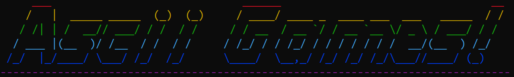
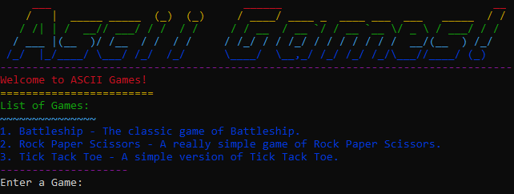

# Asscii Games

## Description
This is a game manager for all of your java ascii games. It is super easy to add games to the manager.

## Inspiration
I wanted a way to easily have asscii games all in one place.

## Current Games
- Battleship - The classic game of Battleship. [@allancoding](https://github.com/allancoding)
- Rock Paper Scissors - A really simple game of Rock Paper Scissors. [@allancoding](https://github.com/allancoding)
- Tic Tac Toe - A simple version of Tick Tack Toe. [@allancoding](https://github.com/allancoding)

## How to play
1. Run the `manager` class.
2. Select a game to play.
3. Play the game and have fun!




## How to add a game
1. Create a new class inside of the games folder.
2. Create nested class inside of the main class name it `Game` 
3. the method `start` should be the main method for the game.
5. You can add a description and name to the game by adding a `description` & `name` variable to the `Game` class.
6. 2 booleans should be passed to the `start` method. The first will be true and the second will be false.
Example:
```java
public class Chess {
    public static class Game {
        public static final String Name = "Chess";
        public static final String Description = "The classic game of Chess.";
        public static void start(boolean, instructions, boolean main) {
            // Game code here
        }
    }
}
```
Note: The methods will need to be static.

## Build
You can easily build the project by running the `build.sh` script. It will out put a jar called `asciiGames.jar`.
```bash
chmod +x build.sh
./build.sh
```

## Run
To run the jar file:
```bash
java -jar asciiGames.jar
```

## Dependencies
- [Java](https://www.java.com/) 8 or higher is required.
- [Janis](https://github.com/fusesource/jansi) 2.4.1 or higher is required.

## Docs for the `ascii` class
The asscii class is used as a helper class for asscii. It has a few methods that can be used to help with the game.

### Methods:
| Method | Description | Parameters | Returns |
| --- | --- | --- | --- |
| `ascii.clear` | Clears the screen. | null | null |
| `ascii.print` | Prints a string to the screen. | `String` - The string to print. | null |
| `ascii.println` | Prints a string to the screen with a new line. | `String` - The string to print. | null |
| `ascii.printerror` | Prints an error message to the screen. | `String` - The error message to print. | null |
| `ascii.printRepeated` | Prints a string repeated a number of times. | `String` - The string to print. <br>`int` - The number of times to print the string. <br>`boolean` - Whether to print a new line at the end. | null |
| `ascii.wait` | Waits for a number of milliseconds. | `int` - The number of milliseconds to wait. | null |
| `ascii.waitForEnter` | Waits for the user to press enter. | `String` - The message to print before waiting. | null |
| `ascii.toS` | Converts a char to a string. | `char` - The char to convert. | `String` - The converted string. |

### Variables:
#### Ascii Characters:
| Variable | Value | Returns |
| --- | --- | --- |
| `ascii.emDash` | ─ | Char |
| `ascii.rectangle` | █ | Char |
| `ascii.box` | ■ | Char |

#### Colors:
| Variable | Description | Returns |
| --- | --- | --- |
| `ascii.ANSI_RESET` | Resets the color. | String |
| `ascii.ANSI_BLACK` | Black color. | String |
| `ascii.ANSI_RED` | Red color. | String |
| `ascii.ANSI_GREEN` | Green color. | String |
| `ascii.ANSI_YELLOW` | Yellow color. | String |
| `ascii.ANSI_BLUE` | Blue color. | String |
| `ascii.ANSI_PURPLE` | Purple color. | String |
| `ascii.ANSI_CYAN` | Cyan color. | String |
| `ascii.ANSI_WHITE` | White color. | String |
| `ascii.ANSI_BLACK_BACKGROUND` | Black background color. | String |
| `ascii.ANSI_RED_BACKGROUND` | Red background color. | String |
| `ascii.ANSI_GREEN_BACKGROUND` | Green background color. | String |
| `ascii.ANSI_YELLOW_BACKGROUND` | Yellow background color. | String |
| `ascii.ANSI_BLUE_BACKGROUND` | Blue background color. | String |
| `ascii.ANSI_PURPLE_BACKGROUND` | Purple background color. | String |
| `ascii.ANSI_CYAN_BACKGROUND` | Cyan background color. | String |
| `ascii.ANSI_WHITE_BACKGROUND` | White background color. | String |

#### Table:
| Variable | Description | Value | Returns |
| --- | --- | --- | --- |
| `ascii.topCornerLeft` | Top left corner of a table. | ┌ | Char |
| `ascii.topCornerRight` | Top right corner of a table. | ┐ | Char |
| `ascii.bottomCornerLeft` | Bottom left corner of a table. | └ | Char |
| `ascii.bottomCornerRight` | Bottom right corner of a table. | ┘ | Char |
| `ascii.side` | Side of a table. | │ | Char |
| `ascii.topT` | Top T of a table. | ┬ | Char |
| `ascii.bottomT` | Bottom T of a table. | ┴ | Char |
| `ascii.leftT` | Left T of a table. | ├ | Char |
| `ascii.rightT` | Right T of a table. | ┤ | Char |
| `ascii.cross` | Cross of a table. | ┼ | Char |
| `ascii.horizontal` | Horizontal line of a table. | ─ | Char |
| `ascii.vertical` | Vertical line of a table. | │ | Char |


## How to contribute
Contributing is super easy. Just add a new game to the games folder and follow the instructions above. Then create a pull request and I will review it.